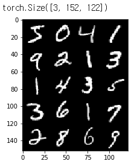

-----
title: 파이토치 실습 및 코드
-----
- GPU 환경으로 변경
```bash
import torch

if torch.cuda.is_available():
  device = torch.device("cuda:0")

```
 
- 데이터 셋 구성

```bash
from torchvision import datasets

PATH_DATA = "./data"
train_data = datasets.MNIST(PATH_DATA, train = True, download=True)
```

-입력 데이터 및 대상 label 추출
```bash
X_train, y_train = train_data.data, train_data.targets
print(X_train.shape)
print(y_train.shape)

val_data = datasets.MNIST(PATH_DATA, train = False, download=True)
print(val_data) #

X_val, y_val = val_data.data, val_data.targets
print(X_val.shape)
print(y_val.shape)
```


```bash
if len(X_train.shape) == 3:
  # 1인 차원을 생성(10,2,7->10,1,2,7)
  # squeeze의 경우 1인 차원을 삭제함(3,1,2->3,2)
  X_train = X_train.unsqueeze(1)
  
print(X_train.shape)

if len(X_val.shape) == 3:
  X_val = X_val.unsqueeze(1) 
print(X_val.shape)
```

- 데이터 시각화 진행

```bash
from torchvision import utils
import matplotlib.pyplot as plt
import numpy as np

%matplotlib inline

def show(img):
  # convert tensor to numpy array
  np_img = img.numpy()

  # Convert to H * W * C shape
  np_img_tr = np.transpose(np_img, (1, 2, 0))

  plt.imshow(np_img_tr, interpolation='nearest')

X_grid = utils.make_grid(X_train[:20], nrow=4, padding=2) #batch가 포함된 dataloader 이미지 텐서들을 도중에 보고자 할 때 사용
print(X_grid.shape)

show(X_grid)
```
